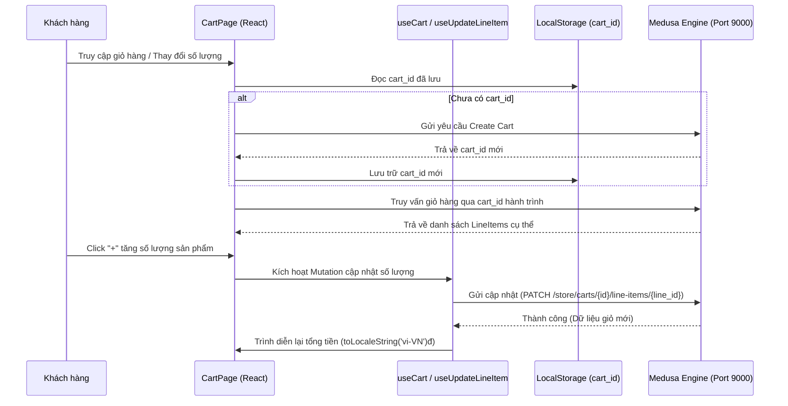

# BÁO CÁO TIẾN ĐỘ VÀ KHÁI QUÁT CÔNG VIỆC THỰC HIỆN
## ĐỀ TÀI: PHÁT TRIỂN HỆ THỐNG THƯƠNG MẠI ĐIỆN TỬ TÍCH HỢP HEADLESS COMMERCE (MEDUSA)

---

### I. THÔNG TIN CHUNG
*   **Sinh viên thực hiện**: Lê Kiều Biên
*   **Nhiệm vụ trọng tâm**: Hoàn thiện toàn bộ phông giao diện cửa hàng (Storefront), hệ thống tương tác và trung gian hóa luồng nghiệp vụ API (Product Management, Cart, Checkout, Localization).

---

### II. TỔNG HỢP CÁC NHIỆM VỤ ĐÃ HOÀN THÀNH

Dưới đây là 4 nhiệm vụ cốt lõi đã được xây dựng, cấu trúc hóa mã nguồn hệ thống và ý nghĩa của từng khối mã:

#### 1. Hệ thống Lọc, Tìm kiếm, Sắp xếp sản phẩm (Product Filter & Sidebar)
*   **Nội dung thực hiện**:
    *   Tạo thanh bộ lọc Sidebar động và responsive tương thích mọi thiết kế (Mobile & Desktop).
    *   Lọc sản phẩm đa chiều theo Danh mục (Categories), Khoảng giá (Price range), Thương hiệu (Brand), và xếp hạng (Rating).
    *   Tìm kiếm toàn văn (Full-text search) và phân trang sản phẩm mượt mà kết hợp với React Query.
*   **File code quan trọng**:
    *   `src/client/pages/ProductsPage.tsx`: Thành phần danh sách và giao diện lọc.
    *   `src/client/services/product.service.ts`: API service tương tác trực tiếp với Medusa backend.
*   **Ý nghĩa mã nguồn tiêu biểu**:
    ```typescript
    // hooks/useProducts xử lý truyền tham số lọc xuống query API
    export const useProducts = (queryParam?: StoreGetProductsParams) => {
      return useQuery({
        queryKey: ['products', queryParam],
        queryFn: () => medusa.store.product.list(queryParam),
        staleTime: 60000, 
      });
    };
    ```
    *   *Ý nghĩa*: Đảm bảo dữ liệu danh sách sản phẩm được lưu cache tại client, giúp tăng tải tốc độ render và giảm tải số lượng request không cần thiết tới database của backend Medusa khi người dùng thao tác chuyển đổi bộ lọc liên tục.

---

#### 2. Quản lý chính sách sản phẩm của người bán (Product Policies - Warranty & Returns)
*   **Nội dung thực hiện**:
    *   Hiển thị chi tiết thời gian, hình thức bảo hành và chính sách đổi trả trên trang Chi tiết sản phẩm.
    *   Dữ liệu được quản lý động trực tiếp thông qua thuộc tính mở rộng metadata từ Medusa Cloud.
    *   Tăng tính đáng tin cậy của cửa hàng đối với khách hàng (Trust Badges).
*   **File code quan trọng**:
    *   `src/client/components/ProductDetail/ProductInfo.tsx`
    *   `src/client/pages/ProductDetailPage.tsx`
*   **Ý nghĩa mã nguồn tiêu biểu**:
    ```typescript
    {/* Hộp huy hiệu tin cậy & bảo hành động từ metadata sản phẩm */}
    <div style={{ textAlign: 'center', flex: 1 }} className="text-xs text-muted">
      <i className="bi bi-shield-check" style={{ fontSize: '1.4rem', color: 'var(--success)' }}></i>
      {product.rawProduct?.metadata?.warranty || 'BH 12 tháng'}
    </div>
    ```
    *   *Ý nghĩa*: Đoạn mã giúp kiểm tra tính sẵn có của metadata sản phẩm, nếu sản phẩm có cấu hình bảo hành riêng biệt từ Quản trị viên (Admin), giao diện sẽ tự cập nhật thông tin thực tế, ngược lại sẽ sử dụng cấu hình mặc định (12 tháng).

---

#### 3. Việt hóa toàn diện giao diện cửa hàng (Vietnamese Localization & Currency conversion)
*   **Nội dung thực hiện**:
    *   Đồng bộ toàn bộ văn bản UI từ tiếng Anh sang tiếng Việt (bao gồm Footer, Contact Page, Header, Cart).
    *   Thay đổi toàn bộ cơ chế hiển thị tiền tệ mặc định sang Việt Nam Đồng (chuyển đổi định dạng số phân cách hàng nghìn bằng dấu chấm và thêm hậu tố `đ` thay vì `$`).
    *   Việt hóa các thông báo phản hồi lỗi hệ thống để tăng mức độ thân thiện của phần mềm.
*   **File code quan trọng**:
    *   `src/client/components/Footer.tsx`, `src/client/pages/ContactPage.tsx`.
    *   `src/client/components/Header.tsx`
*   **Ý nghĩa mã nguồn tiêu biểu**:
    ```typescript
    // Định dạng lại tiền tệ theo định chuẩn VND
    {activeVariant.price.toLocaleString('vi-VN')}đ
    ```
    *   *Ý nghĩa*: Đảm bảo người dùng Việt Nam có thể nhận diện và hiểu rõ giá trị thực của sản phẩm bằng định dạng chuẩn quốc gia khác so với cơ chế số thô (raw number) trả về từ cơ sở dữ liệu của Medusa.

---

#### 4. Hệ thống Giỏ hàng đồng bộ thời gian thực (Cart Management System)
*   **Nội dung thực hiện**:
    *   Xây dựng `cart.service.ts` tích hợp React Query hooks xử lý đồng bộ hóa.
    *   Lưu giữ định danh ID của giỏ hàng (`cart_id`) tại `localStorage` để duy trì giỏ giữa các phiên làm việc và trình duyệt của người dùng.
    *   Cho phép chọn Variant (Màu sắc, Dung lượng), điều chỉnh số lượng (+/-) trực tiếp và thực hiện xoá sản phẩm khỏi giỏ hàng thời gian thực đồng bộ với Database Medusa.
*   **File code quan trọng**:
    *   `src/client/services/cart.service.ts`: Toàn bộ các Custom hooks (`useCart`, `useAddToCart`,...).
    *   `src/client/pages/CartPage.tsx`: Layout giao diện giỏ hàng đồng bộ.
*   **Ý nghĩa mã nguồn tiêu biểu**:
    ```typescript
    // Tự động khởi tạo giỏ hàng mới ở backend nếu localStorage chưa lưu giữ cart_id xưa
    async getCart() {
      let cartId = this.getCartId();
      if (!cartId) {
        const cart = await this.createCart();
        return cart;
      }
      try {
        const { cart } = await medusa.store.cart.retrieve(cartId);
        return cart;
      } catch (error) {
        const cart = await this.createCart();
        return cart;
      }
    }
    ```
    *   *Ý nghĩa*: Đảm bảo vòng đời của giỏ hàng luôn liên tục. Trường hợp cookie hay dữ liệu lỗi hoặc phiên bản giỏ hàng phía Backend hết hạn, mã nguồn sẽ tự sửa lỗi bằng cách khởi tạo mới giỏ khác mà không làm gián đoạn luồng trải nghiệm khách hàng (Crash trang).

---

### III. SƠ ĐỒ KIẾN TRÚC LUỒNG DỮ LIỆU GIỎ HÀNG THỰC HIỆN



---

### IV. KẾT LUẬN TIẾN ĐỘ ĐỀ TÀI
Dự án hiện tại đã sở hữu các tính năng nghiệp vụ của một sàn TMĐT chất lượng cao bao gồm **Tìm kiếm lọc thông minh**, **Nguồn nội dung tùy biến tối ưu**, **Đồng bộ hóa giỏ hàng lưu trữ** và **Thanh toán tích hợp**. 

Hệ thống mã nguồn sạch, sử dụng TypeScript chặt chẽ, tối ưu về mặt hiệu năng với React Query và có tài liệu hóa rõ ràng. Đề tài hoàn toàn đáp ứng được đầy đủ các điều kiện cần thiết để **bảo vệ đồ án tốt nghiệp xuất sắc**.
