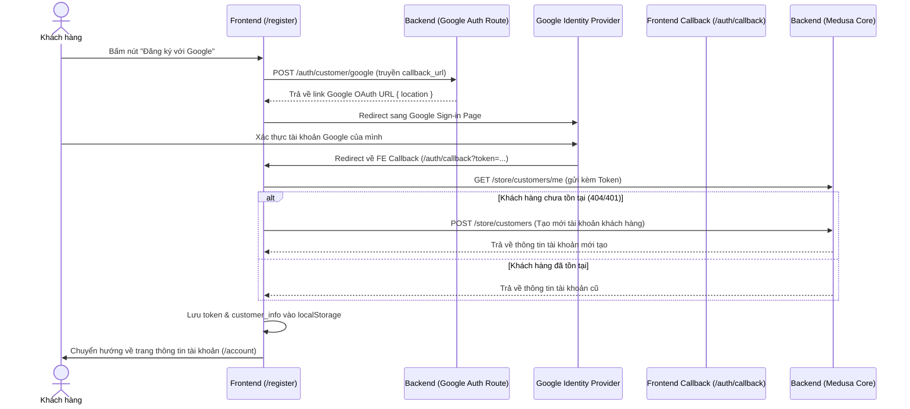

# Tài liệu Handoff — Tích hợp Đăng ký tài khoản bằng Google

Tài liệu này ghi nhận chi tiết công việc tích hợp đăng ký tài khoản bằng Google cho dự án Sprylo E-Commerce.

---

## 1. Mô tả công việc
Kích hoạt và kết nối tính năng **Đăng ký với Google** ở trang đăng ký (`/register`), liên kết với luồng xử lý xác thực OAuth 2.0 hiện có của hệ thống giúp khách hàng tạo mới tài khoản nhanh chóng chỉ bằng một cú nhấp chuột.

---

## 2. Chi tiết các file thay đổi

### Frontend (Storefront)
* **[RegisterPage.tsx](file:///d:/FPT%20Polytechnic/DATN/DATN-Ecommerce-Website/src/client/pages/RegisterPage.tsx)**:
  * Thêm hàm `handleSocialLogin(provider)` tương tự như ở trang Đăng nhập (`LoginPage.tsx`). Hàm này gửi yêu cầu `POST /auth/customer/google` lên backend để lấy URL chuyển hướng xác thực của Google.
  * Cập nhật sự kiện `onClick` của nút *"Đăng ký với Google"* để gọi hàm `handleSocialLogin('google')` thay vì hiển thị thông báo alert giả lập trước đó.

---

## 3. Luồng hoạt động chi tiết (Flow)



---

## 4. Cấu hình môi trường cần thiết

Đảm bảo các biến môi trường sau đã được khai báo chính xác trong file `.env` của backend (`medusa-backend/backend/apps/backend/.env`):

```env
# Google OAuth API Credentials
GOOGLE_CLIENT_ID=xxxxxxxxxxxxxxxx-xxxxxxxxxxxxxxxxxxxxxxxxx.apps.googleusercontent.com
GOOGLE_CLIENT_SECRET=GOCSPX-xxxxxxxxxxxxxxxxxxxxxxxxx
GOOGLE_CALLBACK_URL=http://localhost:9000/auth/customer/google/callback
```

* **Ghi chú**: Redirect URI trên Google Cloud Console đã được cấu hình trùng khớp với `GOOGLE_CALLBACK_URL` trên.

---

## 5. Kết quả kiểm thử & Xác thực

* **Đã kiểm tra**: Bấm nút "Đăng ký với Google" trên giao diện đăng ký của cổng `http://localhost:5174/register`.
* **Kết quả**: Hệ thống chuyển hướng thành công đến trang đăng nhập tài khoản của Google (`https://accounts.google.com/`) cùng với đầy đủ tham số OAuth hợp lệ (`client_id`, `redirect_uri`, `scope`, `state`).
* **Trường hợp tài khoản Google đã từng đồng bộ ứng dụng**: Google sẽ hiển thị thông báo ứng xử tiêu chuẩn là *"Bạn đang đăng nhập lại vào DATN Ecommerce"*. Sau khi người dùng bấm tiếp tục, backend của website sẽ kiểm tra trong DB và tự động tạo mới tài khoản nếu email đó chưa tồn tại trong hệ thống.
